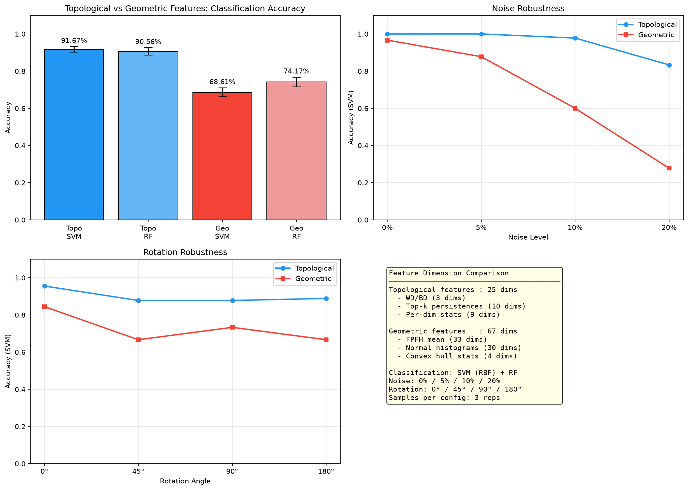
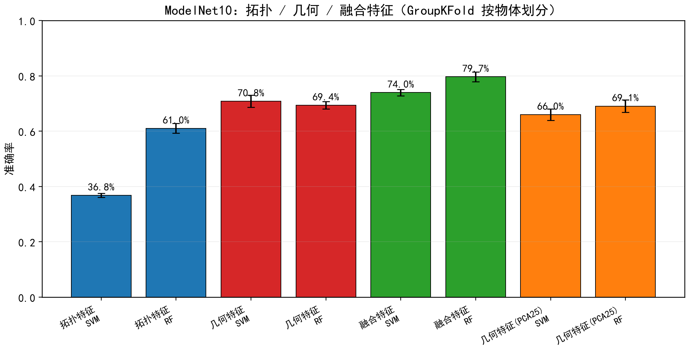
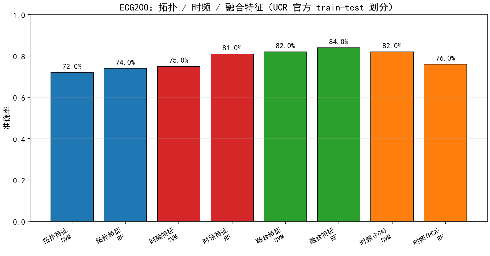
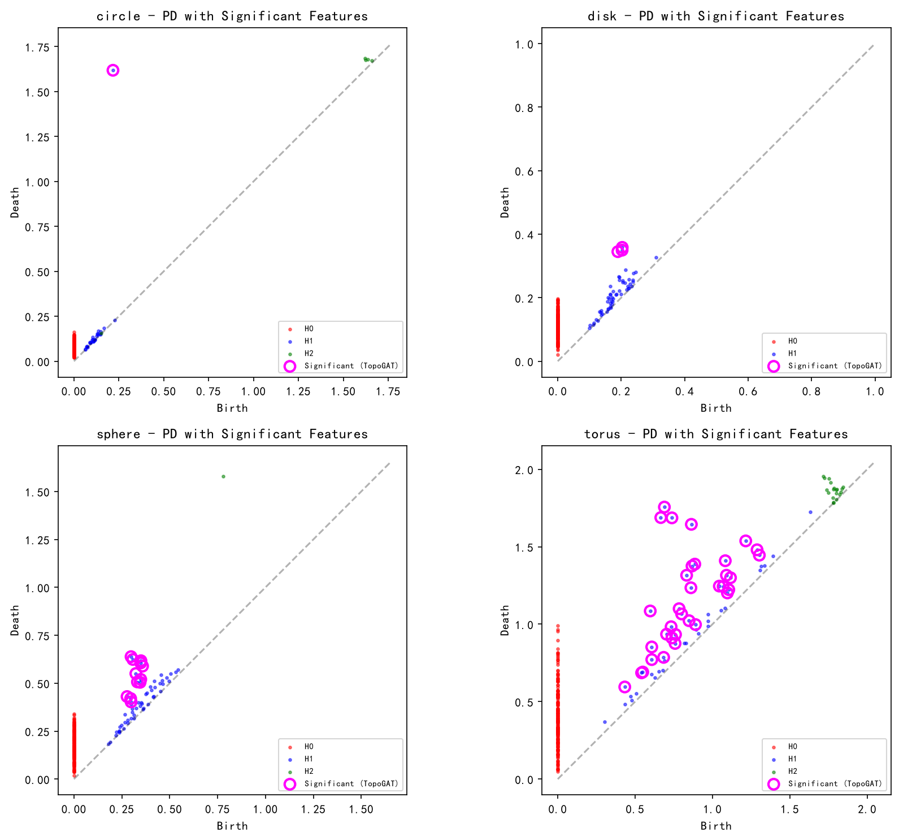

# 基于持续同调的拓扑特征识别及其应用

> 浙江大学大学生创新训练项目（SRTP）· 2026.03 – 2027.05
> 本仓库是该项目的**代码、实验脚本、结果与阅读笔记**汇总，围绕一条主线：
> **持续同调（Persistent Homology）特征在形状数据、时间序列与金融订单流上的识别能力及其边界。**

## 项目简介

持续同调能够在多尺度上刻画点云、图像、网络等数据的拓扑不变量（连通分量、环、空腔），
并且对噪声与采样扰动具有稳定性。本项目以欧氏空间中的 PH 为起点，研究它向更复杂情形推广时的**适用条件**：

- 拓扑特征在什么条件下**优于**传统几何特征？采样规模、噪声、旋转等扰动如何影响其稳定性？
- 面对时间序列这类"没有形状"的数据，如何构造点云（延迟嵌入）并保持拓扑信息的可判别性？
- **把同一套流水线平移到真实金融数据（A 股订单流）后，还成不成立？**（阶段 3）
- 拓扑特征的收益是普适的，还是依赖任务本身的结构？

## 方法

| 环节 | 做法 |
|---|---|
| 拓扑特征 | Vietoris–Rips 过滤 + 持续同调（`ripser`）；提取 WD/BD 持续度、top-k 持续度、持续环数、Betti 曲线 |
| 几何对照 | FPFH、法线直方图、凸包统计、PCA 主轴 |
| 时序嵌入 | Takens 延迟嵌入：互信息/自相关定延迟 $\tau$，假近邻法定嵌入维数 $m$ |
| 分类器 | SVM（RBF）、Random Forest、XGBoost/LightGBM（2A 冲刺）、轻量 MLP（1C） |
| 防泄漏 | 按物体 ID 的 GroupKFold（1C）、UCR 官方 train/test 划分（2A）、purged walk-forward + embargo（3） |
| 金融口径 | 扩张窗口 PIT 特征选择、Newey–West $t$、Rank IC / ICIR、折级配对检验、置换检验 |

## 结果选览

**① 合成点云：拓扑特征 vs 几何特征**（`results/exp1b_topo_vs_geo/`）



左上：分类准确率；右上：噪声鲁棒性；左下：旋转鲁棒性；右下：特征维度构成。
拓扑特征（25 维）在噪声与旋转扰动下明显更稳，几何特征（67 维）在干净数据上接近但抗扰动差。

**② ModelNet10：真实三维物体的拓扑 / 几何 / 融合特征**（`results/exp1c_modelnet10/`）



按物体 ID 做 GroupKFold（同一物体不跨训练/测试），**融合特征最好**。

**③ ECG200：真实时间序列的拓扑 / 时频 / 融合特征**（`results/exp2a_ecg200/`）



延迟嵌入 + PH 得到拓扑特征，与常规时频统计量对照；融合特征优于任何单一特征。
参数扫描（$(m,\tau)$ 网格上的 H1 持续环数）见 `results/exp2a_synth_scan/synth_param_scan_heatmaps.png`。

**④ 阶段 3：A 股订单流的拓扑识别**（`results/exp3a_synthetic/`、`results/exp3c_factor/`、`results/exp3d_increment/`）

把阶段 2A 的「Takens 延迟嵌入 + 持续同调」流水线平移到订单流，做了**四层实验 + 一层增量检验**：

| 层 | 数据 | 结果 |
|---|---|---|
| 1 | 合成订单流（6 结构 × 8 SNR × 4 jitter，N=40/单元） | 经典基线 SNR≥0.3 起飞、≥0.8 饱和；**拓扑只在 SNR≤0.2 的极低信噪比区占优** |
| 2a | CSMAR 日频高频指标（300 股 / 9000 窗口 / 8 通道） | 时序 IC：RAW 0.566 / TOPO 0.261；**TOPO+RAW < RAW** |
| 3 | 月度横截面（扩张窗口 PIT 选因子） | Rank IC：RAW 0.689 / TOPO 0.279（ICIR 3.36）/ CLASSIC 0.138 / ALL 0.529 |
| 2b | baostock 日内 5 分钟（120 股 / 87,115 样本） | fwd_rv5 IC：ALL 0.2140 vs RAW 0.2044，**折级配对检验 p=0.515 → 不是增量** |
| **3 续** | **相对既有 33 因子的正交化增量**（300 只 / 18 月 / 5,400 观测） | ⭐ **拓扑（收益选特征）对 32 因子正交化后残差 Rank IC +0.0331、$t=+2.78$（$p=0.013$）、IC>0 72.2%、置换检验 $p_{\text{perm}}=0.040$**；与既有因子最大 $\lvert r\rvert=0.31$ |

**⚠️ 边界（必须与上面的数字同时读）**：既有 33 因子等权合成在**同一窗口**的 IC 仅 $-0.0080$——
**基准本身是"平的"**，所以上表不能读成"拓扑优于 33 因子"，只能读成
"**拓扑携带了这 32 个因子的线性组合所不包含的信息**"；且样本仅 18 个月（2024-11 – 2026-08）、
股票池偏大盘、多重比较后 $p$ 处边界 ⇒ **定位是「有增量的迹象」，不是「已证实的结论」**。

**最有价值的解释性发现（T0）**：对抗性零模型里，PH 能 **100% 区分** AR(1) 背景与 Hawkes 自激簇发，
但**单标量"环数"判据方向完全相反**（AR 258 环 vs Hawkes 42 环，AUC = 0.000）
⇒ **「环数」度量的是"噪声度"而非"结构化程度"**，不能把"PH 检出结构"解读为"存在周期性下单"。

## 仓库结构

```
src/
  ph_pipeline.py                         持续同调核心工具（点云生成 / PH / 向量化 / 绘图）
  experiment_1a_param_scan.py            参数与计算复杂度扫描：子采样比例 × maxdim
  experiment_1a_threshold_sensitivity.py 绝对 WD 阈值的稳健性分析
  experiment_1b_topo_vs_geo.py           合成点云：拓扑特征 vs 几何特征
  experiment_1c_modelnet10.py            ModelNet10 真实物体分类（拓扑 / 几何 / 融合）
  experiment_2a_time_series.py           合成动力学时序生成器（周期 / 拟周期 / 混沌 / 噪声）
  experiment_2a_embedding.py             延迟嵌入 → PH 管道（m、τ 选取）
  experiment_2a_synth_scan.py            合成动力学批量参数扫描（(m,τ) 网格）
  experiment_2a_criterion.py             持续环判据优化（环数 / top-k / 分位数）
  experiment_2a_ecg200.py                ECG200 真实时序二分类实证
  experiment_2a_ecg200_boost.py          ECG200 特征扩展与集成冲刺
  ofgen.py                               阶段 3：合成订单流生成器（6 结构；AR(1) + 可选 Hawkes）
  tda3_common.py                         阶段 3：共享模块（Takens 嵌入 / 多通道点云 / PH / 判据 /
                                         FixedVectorizer / 经典基线特征 / purged walk-forward）
  experiment_3a_synthetic.py             阶段 3 第 1 层：合成订单流（SNR 扫描 / jitter 扫描 / 六分类 / T0 对抗零模型）
  experiment_3b_csmar_hf.py              阶段 3 第 2 层a：CSMAR 日频高频微观结构序列
  experiment_3b_intraday.py              阶段 3 第 2 层b：baostock 日内 5 分钟序列（PIT 滚动季节调整）
  fetch_intraday.py                      阶段 3：baostock 5 分钟下载器（可续跑）
  experiment_3c_factor.py                阶段 3 第 3 层：月度横截面因子评估（扩张窗口 PIT）
  experiment_3d_increment.py             阶段 3 第 3 层续：相对既有 33 因子的增量 IC
  experiment_3d_robust.py                阶段 3 第 3 层续：稳健性（top-k 扫描 + 置换检验）
  plot_3a.py                             阶段 3 第 1 层出图（中文字体自动探测）
  pipeline_paper1_dna.py                 …论文 pipeline 复现（见下）
  pipeline_paper2_jet_tagging.py
  pipeline_paper3_topogat.py
  pipeline_paper4_3dphdl.py
  pipeline_paper5_filtration_learning.py
run_subtask_a.py / run_all_pipelines.py / run_stability.sh   批量运行入口

results/
  exp1a_param_scan/                      参数扫描结果与图（含阈值稳健性子目录）
  exp1b_topo_vs_geo/                     拓扑 vs 几何：汇总表、对比图、混淆矩阵、特征矩阵
  exp1c_modelnet10/                      ModelNet10 汇总表、对比图、特征矩阵
  exp2a_synth_scan/                      合成动力学参数扫描热力图与汇总表
  exp2a_criterion/                       判据优化：持续图缓存
  exp2a_ecg200/                          ECG200 汇总表、对比图、冲刺结果
  exp3a_synthetic/                       阶段 3 第 1 层：summary_*.csv / result_*.json / 6 张 PNG
  exp3b_csmar_hf/                        阶段 3 第 2 层a：result_*.json（特征缓存与索引不入库）
  exp3b_intraday/                        阶段 3 第 2 层b：result_*.json / README.md
  exp3c_factor/                          阶段 3 第 3 层：factor_*.json / *.csv
  exp3d_increment/                       阶段 3 第 3 层续：monthly_*.csv / result_*.json / robust_*.json
  paper1..paper5_*.png                   pipeline 复现输出
  pipeline复现参考结果/                   同一批复现图的归档副本

docs/
  阶段2A_延迟嵌入参数选取.md              嵌入参数选取的设计说明
  阶段3_金融拓展_设计.md                 阶段 3 设计文档（含数据坑清单）
  第八章_阶段三_金融拓展.md               结题报告第八章独立文件
  8.6b_增量IC.md                         §8.6.1 增量 IC 的独立片段（便于复核）
  CTDA阅读笔记理论部分整合.tex/.pdf       《Computational Topology for Data Analysis》阅读笔记
  CTDA第三章算法部分.tex/.pdf             第三章（算法部分）笔记
  CTDA理论/算法部分重点梳理（手写）.pdf     手写梳理
  项目进度以及后续计划2026.7.22.txt        项目进度记录

data/ecg200/                             UCR ECG200（公开数据，随仓库提供）
STAGE1_SUMMARY.md                        阶段 1 总结：三维场景拓扑识别
STAGE2A_SUMMARY.md                       阶段 2A 总结：时序拓扑表征
STAGE3_SUMMARY.md                        阶段 3 总结：金融时序中的订单流拓扑识别
```

## 论文 pipeline 复现

项目起步阶段复现了 5 条公开的 TDA 应用流水线，用于校准自己的实现：

| 脚本 | 复现对象 |
|---|---|
| `pipeline_paper1_dna.py` | DNA 结构的持续同调分析（Persistent Homology: A Pedagogical Introduction） |
| `pipeline_paper2_jet_tagging.py` | 喷注 tagging 中的拓扑特征 |
| `pipeline_paper3_topogat.py` | TopoGAT：图注意力 + 拓扑特征选择（下图） |
| `pipeline_paper4_3dphdl.py` | 3D-PHDL：三维形状的持续同调描述子 |
| `pipeline_paper5_filtration_learning.py` | 自适应过滤学习（NeurIPS 2023, Adaptive Topological Feature via PH Filtration Learning） |



输出图见 `results/paper*_*.png`。

## 数据说明

| 数据 | 来源 | 是否随仓库提供 |
|---|---|---|
| 合成点云（circle / disk / torus / sphere / porous_block） | `src/ph_pipeline.py` 内置生成器（固定随机种子） | 无需下载 |
| 合成动力学时序（周期 / 拟周期 / 混沌 / 纯噪声） | `src/experiment_2a_time_series.py` | 无需下载 |
| 合成订单流（6 结构；AR(1) 背景 + 可选 Hawkes 自激） | `src/ofgen.py`（固定随机种子） | 无需下载 |
| ECG200（UCR Time Series Classification Archive） | 公开数据集 | ✅ `data/ecg200/` |
| ModelNet10 | ModelNet 官方发布（10 类 CAD 模型，`.off`） | ❌ 体积大，自行下载到 `data/modelnet10/` |
| CSMAR 日频高频指标（`HF_BSImbalance` / `HF_Spread` / `HF_StockRealized` / `HF_VPIN`） | CSMAR（**授权数据，不入库**）。⚠️ 实测 CSMAR 全清单 198 库 / 5001 表中**没有任何日内/逐笔表**，HF 系列均为日频且固有起始 2023-10 | ❌ |
| A 股 5 分钟线 | baostock（免费，48 bar/日，2020 年起） | ❌ 用 `src/fetch_intraday.py` 自行下载 |
| 既有因子面板（第 3 层续的正交化基准） | 作者自建的 CSMAR 全历史月度面板与因子评估框架 | ❌ |

## 复现

```bash
pip install -r requirements.txt

python src/experiment_1a_param_scan.py           # 参数扫描
python src/experiment_1a_threshold_sensitivity.py
python src/experiment_1b_topo_vs_geo.py          # 拓扑 vs 几何
python src/experiment_1c_modelnet10.py           # ModelNet10（需先准备数据）
python src/experiment_2a_synth_scan.py           # 合成动力学扫描
python src/experiment_2a_criterion.py            # 判据优化
python src/experiment_2a_ecg200.py               # ECG200 实证

# 阶段 3
python src/experiment_3a_synthetic.py --tag v3_fixed        # 第 1 层（确定性种子）
python src/fetch_intraday.py --n 120                        # 第 2 层b 数据（可续跑）
python src/experiment_3b_intraday.py --tag n120_5min
```

所有生成过程使用固定随机种子；每个结果目录下 `*.csv` / `*.json` 为原始结果，`*.png` 为对应图。
⚠️ 阶段 3 第 2 层a / 第 3 层依赖原始 CSMAR 数据与既有因子面板（不入库），
需按 `docs/阶段3_金融拓展_设计.md` 自行获取。

## 阶段性认识

- **特征互补而非替代**：形状数据上拓扑特征对形变、噪声与旋转更稳健；几何特征对局部细节更敏感，
  二者融合通常优于任何单一特征（`results/exp1b_topo_vs_geo/`、`results/exp1c_modelnet10/`）。
- **参数存在"够用即可"的平台区**：过滤步长、子采样比例、嵌入参数 $(m,\tau)$ 超过某个阈值后，
  计算代价继续上升而判别力不再提升（`results/exp1a_param_scan/`、`results/exp2a_synth_scan/`）。
- **收益依赖任务本身的结构**：任务没有拓扑结构时，PH 更接近在描述噪声；
  时序上的适用边界由 `results/exp2a_*` 给出，判据（环数 / top-k / 分位数）的选择直接决定可用性。
- **平移到金融数据后基本是负面结论**：相对简单统计量（窗口原始矩、周期图、自相关、SSA）在
  合成数据与三个真实口径上都没有增量；**唯一正向迹象是相对既有 33 因子线性组合的正交化残差**
  （+0.0331，$t=2.78$，置换 $p=0.040$），但受 18 个月样本与基准窗口自身失效限制，
  只能算**迹象**而非结论（`STAGE3_SUMMARY.md`、`results/exp3d_increment/`）。
- **"环数"是噪声度而非结构化程度**：见上文 T0 发现——这条解释了阶段 2A 的"白噪声环数 > 混沌环数"，
  也提醒不要过度解读 PH 的"检出结构"。

## 许可

MIT License，见 [LICENSE](LICENSE)。
